

  <h1>Conway's Game of Life</h1>
  
A cellular automaton devised by British mathematician John Horton Conway in 1970.

---
## GitHub Repository Stats 

<table align="center">
    <thead align="center">
        <tr border: 1px;>
            <td ><b>🌟 Stars</b></td>
            <td ><b>🍴 Forks</b></td>
            <td ><b>🐛 Issues</b></td>
            <td ><b>🔔 Open PRs</b></td>
            <td ><b>🔕 Closed PRs</b></td>
        </tr>
     </thead>
    <tbody>
         <tr>
            <td></td>
             <td></td>
            <td></td>
            <td></td>
           <td></td>
        </tr>
    </tbody>
</table>

  ## 🏆 Featured in:

<table>
    <tr>
      <th>Event Logo</th>
      <th>Event Name</th>
      <th>Event Description</th>
    </tr>
    <tr>
        <td></td>
        <td>GirlScript Summer of Code 2024</td>
        <td>GirlScript Summer of Code is a three-month-long Open Source Program conducted every summer by GirlScript Foundation. It is an initiative to bring more beginners to Open-Source Software Development. 
    </tr>
</table>

---

  
<h2>:pushpin:Table of Contents:</h2>

  
1. [What is it?](#what-is-it)
   1. [The Universe](#the-universe)
   2. [The Rules](#the-rules)
   3. [The Game](#the-game)
2. [The Canvas / Grid](#the-canvas--grid)
3. [The Settings](#the-settings)
4. [The Themes](#the-themes)
5. [The Presets](#the-presets)
   1. [Glider](#glider)
   2. [Big Glider](#big-glider)
   3. [Gosper Glider Gun](#gosper-glider-gun)
   4. [Pulsar](#pulsar)
   5. [Circle of Fire](#circle-of-fire)
   6. [Quadpole](#quadpole)
   7. [Spider](#spider)
   8. [Spaceship](#spaceship)
   9. [Boat-Tie](#boat-tie)
   10. [Pentadecathlon](#pentadecathlon)
6. [Feedback](#feedback)
7. [Resources](#resources)
   

## What is it?

✨ Conway's Game of Life, or simply "Life," is a cellular automaton devised by British mathematician John Horton Conway in 1970. It is a zero-player game, meaning its evolution is determined by its initial state, requiring no further input. Players interact with the game by creating an initial configuration and observing how it evolves. The game is Turing complete and can simulate a universal constructor or any other Turing machine.

---

## The Universe

🌌 The universe of the Game of Life is an infinite, two-dimensional orthogonal grid of square cells. Each cell is in one of two possible states: `ALIVE` or `DEAD`. Every cell interacts with its eight neighbors, which are the cells that are horizontally, vertically, or diagonally adjacent.

---
## The Rules

1. Any live cell with fewer than two live neighbors dies, as if by **underpopulation**.
2. Any live cell with two or three live neighbors lives on to the next generation.
3. Any live cell with more than three live neighbors dies, as if by **overpopulation**.
4. Any dead cell with exactly three live neighbors becomes a live cell, as if by **reproduction**.

The first generation is created by applying the above rules simultaneously to every cell in the seed, alive or dead; births and deaths occur simultaneously, and the discrete moment at which this happens is sometimes called a tick. Each generation is a pure function of the preceding one.

---

  
<h2>🎮The Game</h2>

  

### The Canvas / Grid

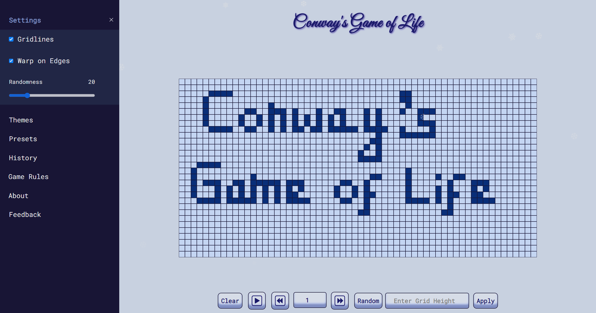

### Buttons

| Buttons | What they do |
| --- | --- |
|   ▶️   | Starts the animation after you've set the initial pattern |
|   ⏸️   | Pauses the animation |
|   ⏩   | Increases the speed of the animation |
|   ⏪   | Decreases the speed of the animation |
| `Clear` | Clears the grid on click, only if the game is not animating at that moment |
| `Random` | Randomly initializes the grid with initial randomness as 20% |
|`Change grid size`| This function allow you to change the size of grid according to your preference|

### ⌨️ Keyboard Shortcuts

| Keybind | What they do |
| --- | --- |
|   `P` or `Space Bar`   | Starts the animation after you've set the initial pattern and Pauses an ongoing animation |
|    `F` or `[→]` (Arrow Right)  | Increases the speed of the animation |
|   `S` or `[←]` (Arrow Left)             | Decreases the speed of the animation |
| `D` or `Delete` | Clears the grid on click, only if the game is not animating at that moment |
| `R` | Randomly initializes the grid with initial randomness as 20% |
| `[↑]` (Arrow Up) | Increases the Randomness value by 5% |
| `[↓]` (Arrow Down) | Decreases the Randomness value by 5% |
| `G` | Toggles Gridlines On / Off |
| `M` | Toggles Music On / Off |

### ⚙️ The Settings

| ⚙️  Settings | What are they for? |
| --- | --- |
| `Gridlines` | Toggles visibility of the gridlines |
| `Warp on Edges` | Warps the patterns across the edges - Initially set as true |
| `Randomness` | Allows you to set custom randomness percent for random initialization |

### The Themes

#### Preset Themes :
| 🎨 Themes | The Colors |
| --- | --- |
| Blue (default) |           |
| Red |           |
| Green |           |
| Purple |           |
| Dark Cyan |           |
| Black and White |           |
| Dark Neon |           |
| Cyberpunk |           |
| Sunset |           |

#### Custom Theme :
- It also allows the user to choose colors according to their preferences to create their unique Custom Theme.

#### Gradient Theme :
- You can also choose 2 colors to create a Gradient Background.
- The Gradient Theme setting also allows users to select the slope of linear Gradient.
- The Gradient Theme also affects the color of Alive and Dead cells, so that it matches with the Gradient Background.

### ⏳ History

Stores history of patterns that user has played with, up to 5 recent patterns.

  
<h2>✨The Presets </h2>

### Glider

The glider is the smallest, most common, and first-discovered spaceship in Game of Life. It travels diagonally across the grid. Gliders are important because they are easily produced, can be collided with each other to form more complicated patterns, and can be used to transmit information over long distances.

  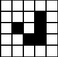
  

### Big Glider

The big glider was found by Dean Hickerson in December 1989 and was the first known diagonal spaceship other than the glider. Two gliders can be temporarily seen at the front of the ship; these do not stay gliders but still move like them.

  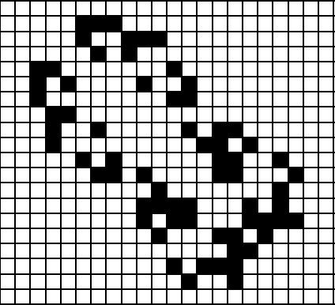
  

### Gosper Glider Gun

The Gosper glider gun is the first known gun, and indeed the first known finite pattern with unbounded growth, found by Bill Gosper in November 1970. It consists of two queen bee shuttles stabilized by two blocks.

  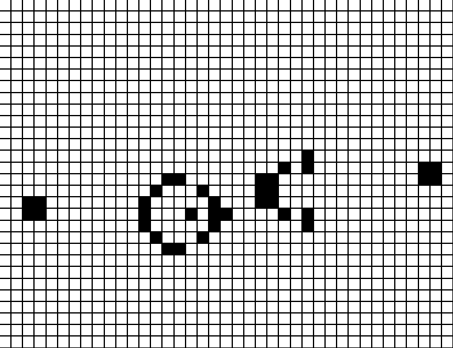
  

### Pulsar

The pulsar is a period-3 oscillator, meaning it returns to its initial state after three generations. It’s a symmetric pattern and one of the most recognized oscillators in the Game of Life.

  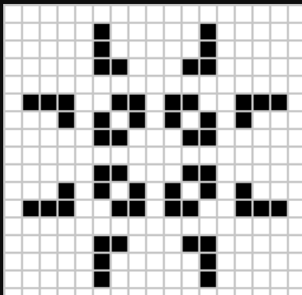
  

### Circle of Fire

This term isn’t standard in the Game of Life nomenclature but could refer to a specific type of oscillator or a similar repeating pattern that creates a visual effect resembling a circle of fire.

  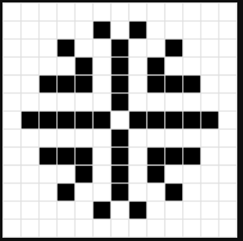
  

### Quadpole

The quadpole is the eighth most common oscillator in Achim Flammenkamp's census, being less common than the bipole but more common than the great on-off. It is the eighth most common oscillator on Adam P. Goucher's Catagolue.

  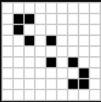
  

### Spider

Spider is a c/5 orthogonal spaceship that was discovered by David Bell on April 14, 1997. It is the smallest known c/5 orthogonal spaceship. Its side sparks have proven to be very useful in constructing puffers and rakes.

  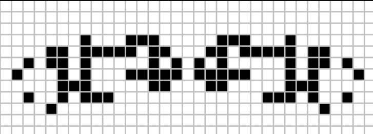
  

### Spaceship

 The middleweight spaceship (commonly abbreviated to MWSS) or (rarely) medium fish is the third most common spaceship after the glider and lightweight spaceship.It was found by John Conway in 1970 and travels at c/2 orthogonally.

 

  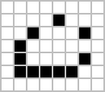
  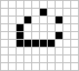

### Boat-Tie

Boat-tie is the twentieth most common still life on Adam P. Goucher's Catagolue, being less common than shillelagh but more common than snake.It is also the twenty-seventh most common object overall on Catagolue.Two copies of boat-tie can be seen in a symmetric constellation that evolves from two traffic light predecessors.

 

  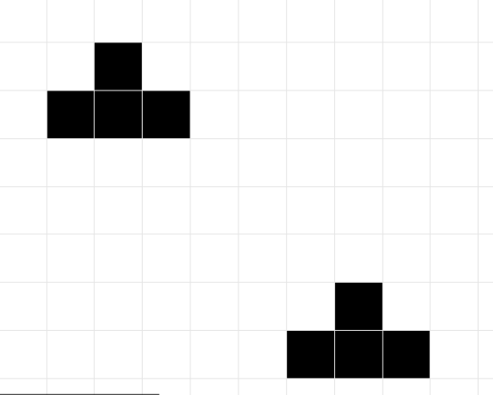
  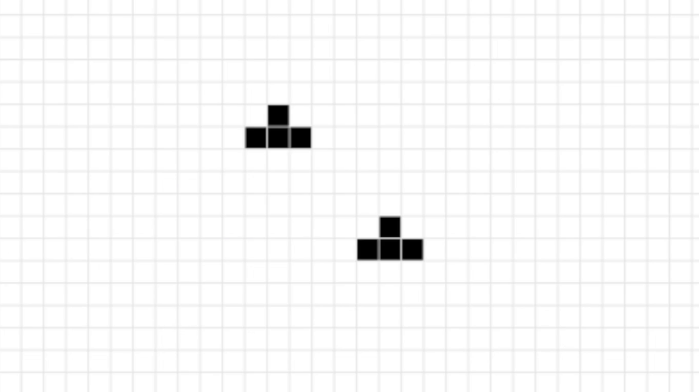

### Pentadecathlon

The Pentadecathlon is a period-15 oscillator that was found in 1970 by John Conway. It is one of the most well-known patterns in the Game of Life, notable for its longevity and distinctive structure.

  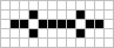
  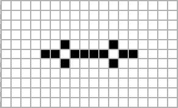

### More Configurations

Explore more patterns at [ConwayLife Patterns](https://conwaylife.com/wiki/Category:Patterns).

---
## Feedback 
- 💬 Now the page supports user feedback. Which redirects you to a Feedback.html page.
- 💬 In the Feedback page, user can file a feedback for 'Complaint', 'Suggestion', 'Question', etc.*

---

## Resources

### Spark your interest 

- [The Game of Life | John Conway | TEDxDanubia](https://www.youtube.com/watch?v=R9Plq-D1gEk)
- [Conway's Game of Life Explained](https://youtu.be/C2vgICfQawE?si=yWqN0BOSBOMaujkI)

### Try playing it here

- [Play Game of Life](https://playgameoflife.com/)
- [Conway Life](https://conwaylife.com/)

### Further Reading

- [Conway's Game of Life Wiki](https://conwaylife.com/wiki/)
- [Wikipedia: Conway's Game of Life](https://en.wikipedia.org/wiki/Conway%27s_Game_of_Life)

---

  <h2>Conway's Game of Life offers a unique way to explore the unpredictable beauty of life itself.</h2>

 <!---------------------------------------------------------------CONTRIBUTION GUIDELINES--------------------------------------------------------------------------->

 
<h2>⚡Contribution Guidelines:</h2>

 
 
 * **Checkout and make your changes for the develop branch only:** When working on your contributions, switch to the **develop** branch in your local repository. This ensures that you are working on the latest version of the codebase.

* **Create pull requests only for the develop branch:** When you are ready to submit your changes, create a pull request (PR) targeting the **develop** branch. This allows the maintainers to review and merge your code into the main development branch.

* **Format your commit message with the issue number:** When making commits related to an issue, follow the format **Fixes: #32 in your commit message. Replace 32 with the issue number you are addressing.** This helps track and manage issues more efficiently.

* **Make your pull request descriptive and include examples:** When creating a pull request, provide a clear and descriptive explanation of the changes you made. This helps reviewers understand the purpose and significance of your contribution. Additionally, including at least one example that demonstrates the intended usage or effect of your changes can be beneficial.

* **Rebase your commits and optimize file changes:** When submitting your pull request, consider rebasing your commits into one commit and optimizing your file changes. This helps keep the commit history clean and makes it easier for reviewers to understand your changes.

Remember, following these guidelines will help ensure a smooth and efficient contribution process. Happy coding!

<!-- Code of conduct -->

<h2> Code of Conduct</h2>

Please note that this project is released with a [Contributor Code of Conduct](./CODE_OF_CONDUCT.md). By participating in this project you agree to abide by its terms.

<!-- License -->

<h2> License</h2>

This project is licensed under the [GPL-3.0 License](LICENSE.md).

## Contact Us

 <!-- Cotributors -->

  <h2> Contributors</h2>

Thank you for contributing to our project! Your help is greatly appreciated in making gameoflife even better. 😊

  <h2> Support </h2>

  Don't forget to leave a star for this project!

  

<a href="#top" style="position: fixed; bottom: 20px; right: 20px; background-color: black ; color: white; padding: 10px 20px; text-align: center; text-decoration: none; display: inline-block; border-radius: 5px; font-family: Arial; font-size: 16px;">Go to Top</a>
